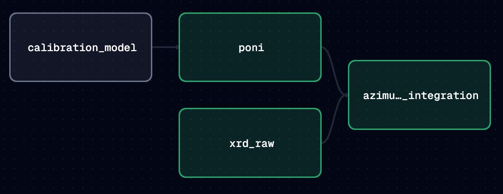

# MAXIMA Dagster Modules

Dagster project for sensor-driven XRD experiment processing against Girder-backed data from MAXIMA.
It detects new experiments, materializes partitioned assets, caches model/calibration artifacts,
and publishes processed XRD outputs back to Girder.



## What It Does

- Polls Girder partition endpoints for XRD experiment and calibrant updates.
- Triggers one Dagster run per new experiment using dynamic partitions.
- Builds an XRD pipeline that includes scan loading, calibration model use, PONI generation, and azimuthal integration.
- Publishes XRD result artifacts and metadata back to the experiment folder in Girder.
- Caches heavy artifacts locally to reduce repeated compute:
  - model files in `data/models`
  - PONI files and index metadata in `data/calibrations`

## Current Pipeline Scope

- XRD sensor-driven flow is operational and is the project scope.
- XRF processing is out of scope for this project.

## Core Components

- `xrd_experiment_sensor`: monitors `xrd_raw` partition checksums and launches `xrd`.
- `xrd_calibration_sensor`: monitors `xrd_calibrant_raw` partition checksums and launches `calibration_precompute`.
- `xrd`: materializes XRD assets for a partitioned experiment.
- `calibration_precompute`: precomputes and refreshes calibration prerequisites.

## Repository Layout

- `src/MaximaDagster/`: Python package for the Dagster project.
- `src/MaximaDagster/definitions.py`: Dagster definitions and job wiring.
- `src/MaximaDagster/assets.py`, `sensors.py`, `resources.py`: core Dagster configuration and orchestration.
- `src/MaximaDagster/modules/`: XRD processing modules and pipeline steps.
- `src/MaximaDagster/utils/`: shared Girder, pattern, PONI, and results publishing helpers.
- `src/MaximaDagster/defs/`: package namespace for Dagster definition exports.
- `tests/`: pytest coverage for assets, modules, and sensor/integration behavior.
- `data/`: local cache for models and calibration outputs.
- `dagster_home/`: Dagster instance configuration and run/storage artifacts.
- `docs/source/`: Sphinx source documentation.
- `docs/build/`: generated HTML docs for GitHub Pages deployment.
- `docker-compose.yml` and `Dockerfile`: containerized runtime.

## Prerequisites

- Python `>=3.11,<3.15`
- Access to the target Girder instance and folder IDs
- Optional: Docker + Docker Compose for containerized deployment

## Required Environment Variables

Copy `.env.example` to `.env` and provide values:

- `GIRDER_API_URL`: Girder API base URL
- `GIRDER_API_KEY`: API key for an account with read/write access to relevant folders
- `GIRDER_MODEL_ITEM_ID`: Girder item ID for the `.pth` calibration model

## Local Development

### 1. Create and activate an environment

Example (Conda):

```powershell
conda create -n dagster python=3.11 -y
conda activate dagster
```

### 2. Install dependencies

```powershell
pip install -e .
pip install dagster-webserver dagster-dg-cli pytest sphinx sphinx-rtd-theme
```

### 3. Configure environment variables

On PowerShell:

```powershell
Copy-Item .env.example .env
# Edit .env with your Girder values
```

Set `DAGSTER_HOME` for the current shell:

```powershell
$env:DAGSTER_HOME = (Resolve-Path .\dagster_home)
```

### 4. Run Dagster locally

```powershell
dagster dev -w workspace.yaml
```

Open the UI at `http://localhost:3000`.

Enable the sensors in the "Automation" tab to start monitoring for new experiments and calibrant updates.

## Docker Quickstart

1. Create and edit `.env`:

```powershell
Copy-Item .env.example .env
```

1. Build and start services:

```powershell
docker compose up --build -d
```

2. View the Dagster UI:

- `http://localhost:3000`

3. Tail logs for sensors and webserver:

```powershell
docker compose logs -f dagster-daemon dagster-webserver
```

4. Stop services:

```powershell
docker compose down
```

## Operational Notes

- Tests can be run with pytest
- Experiment partition keys are Girder experiment folder IDs
- Caching reduces repeated downloads/recalibration but can be invalidated by deleting local cache files under `data/models` and `data/calibrations`.
- `dagster_home/` contains local Dagster state
- The active runtime publication path currently uploads PONI + azimuthal CSV artifacts.

## Troubleshooting

- No sensor runs: verify all required `GIRDER_*` variables are set and valid.
- Runs fail to load assets: confirm `workspace.yaml` resolves `MaximaDagster.definitions` in your environment.
- Calibration not refreshing: ensure new calibrant scans match the expected filename pattern `xrd_calibrant_data_<id>.h5`.
